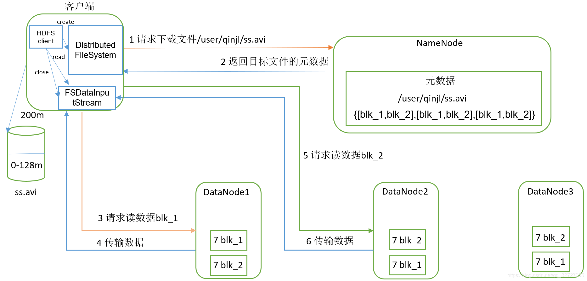

HDFS读文件整体流程

1、打开HDFS文件： HDFS客户端首先调用DistributedFileSystem.open方法打开HDFS文件，底层会调用ClientProtocal.open方法，返回一个用于读取的HdfsDataInputStream对象

2、从NameNode获取DataNode地址：在构造DFSInputStream的时候，对调用ClientPortocal.getBlockLocations方法向NameNode获取该文件起始位置数据块信息。NameNode返回的数据块的存储位置是按照与客户端距离远近排序的。所以DFSInputStream可以选择一个最优的DataNode节点,然后与这个节点建立数据连接读取数据块

3、连接到DataNode读取数据块： HDFS客户端通过调用DFSInputSttream从最优的DataNode读取数据块，数据会以数据包packet形式从DataNode以流式接口传送到客户端，当达到一个数据块末尾的时候,DFSInputStream就会再次调用ClientProtocal.getBlockLOctions获取下一个数据块的位置信息，并建立和这个新的数据块的最优节点之间的连接，然后HDFS继续读取数据块

4、客户端关闭输入流
注意：客户端读取数据块的时候，很有可能这个数据块的DataNode出现异常，也就是无法读取数据。这时候DFSInputStream会切换到另一个保存了这个数据块副本的DataNode，然后读取数据。另外，数据块的应答不仅包含了数据块还包含了校验值，HDFS客户端收到数据应答包的时候，会对数据进行校验，如果校验错误，也就是DataNode这个数据块副本出现了损坏，HDFS 客户端会通过ClientProtocal.reportBadBlocks向NameNode汇报这个损坏的数据块副本，同时DFSInputStream会尝试从其他DataNode读取这个数据块
