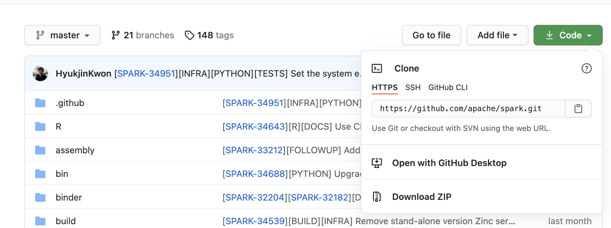
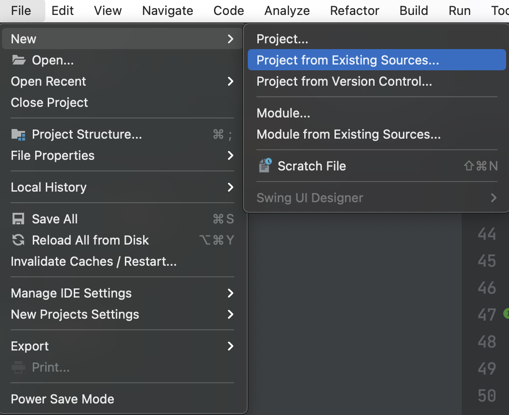
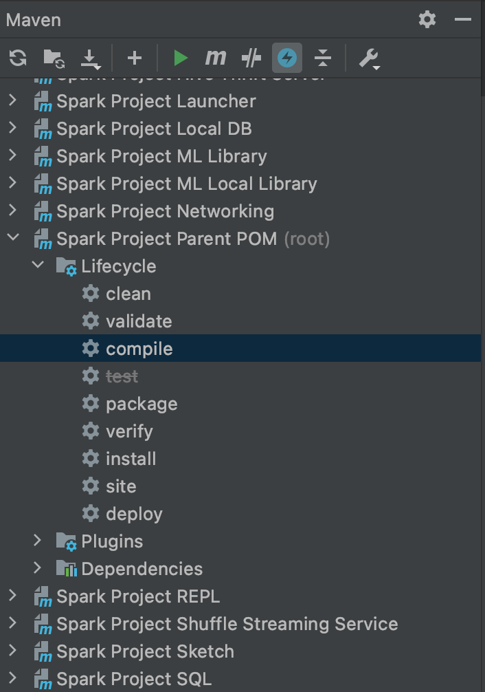
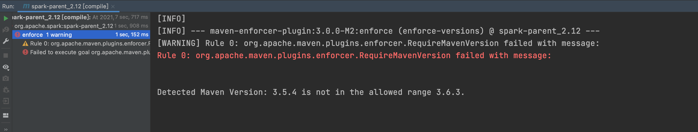
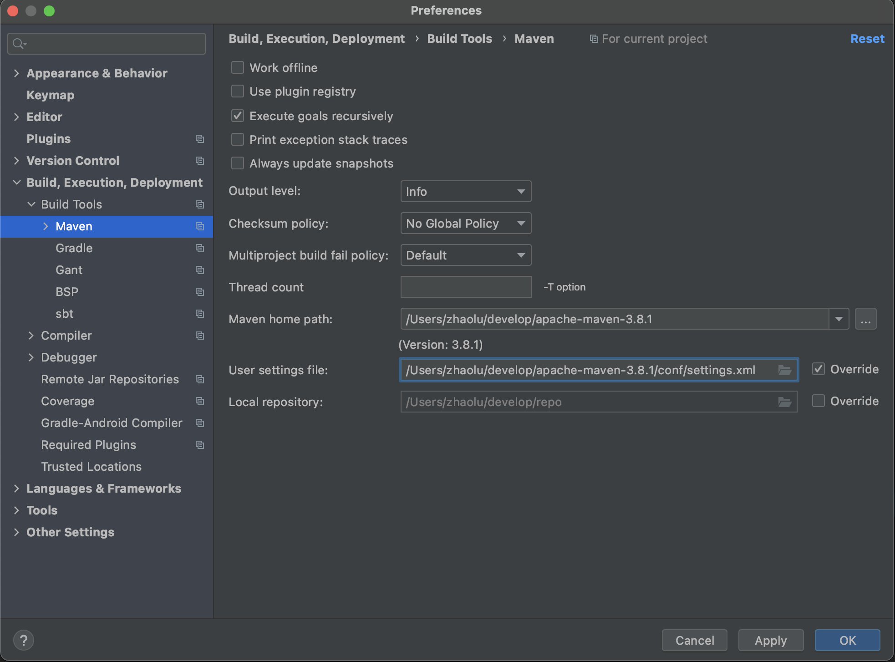
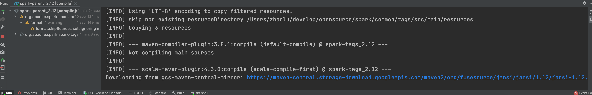

# 本地编译

## 下载Spark源码

1. 准备git工具
2. 访问官网：[https://github.com/apache/spark](https://github.com/apache/spark)



3. clone代码到本地

``` bash
git clone https://github.com/apache/spark.git
```

## IDEA编译

1. 安装scala插件
2. 通过引入spark根路径的pom引入spark工程



3. 引入后会自动下载依赖包
4. 使用man编译，先勾选skip test，选择compile



## FAQ

### MAVEN版本过低



解决方法：

1. 下载符合要求的maven版本
2. 配置idea的maven



### 编译卡在下载依赖处，googleapis访问很慢



解决方法：

1. 在根pom中注释spark自带的repositories和pluginRepositories
2. maven setting中配置比较快的maven远程仓镜像

### java: 程序包sun.misc不存在