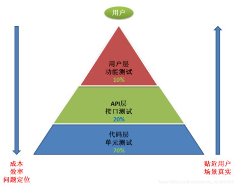

# 大数据自动化测试

## 测试规范

**内容包括：**总体测试策略、自动化测试流程、用例设计原则，缺陷提交要求，自动化定时执行和反馈等。

## 测试流程

## 测试工具

| 类别           | 工具                                                         |
| -------------- | ------------------------------------------------------------ |
| WEB UI自动化： | selenium、robotframework                                     |
| 接口自动化：   | Jmeter、Postman、soapUI、requests、httprunner                |
| App自动化：    | Appium、Monkey、Monkeyrunner、UIautomation，UIAutomator，Robotium，macaca，airtest |
| PC端自动化：   | QTP(UFT)                                                     |
| 云测平台       | Testin、百度云测                                             |
| 性能测试：     | Jmeter、LoadRunner                                           |
| 安全测试：     | Appscan                                                      |
| 持续集成：     | Jenkins                                                      |

### Selenium

官网：https://www.selenium.dev/

Selenium是一个用于Web应用程序测试的工具，Selenium已经成为Web自动化测试工程师的首选。Selenium测试直接运行在浏览器中，就像真正的用户在操作一样。支持的浏览器包括IE(7、8、9)、Mozilla Firefox、Mozilla Suite等。这个工具的主要功能包括：测试与浏览器的兼容性——测试你的应用程序看是否能够很好得工作在不同浏览器和操作系统之上。测试系统功能——创建回归测试检验软件功能和用户需求。支持自动录制动作和自动生成 .Net、Java、Perl等不同语言的测试脚本。Selenium 是ThoughtWorks专门为Web应用程序编写的一个验收测试工具。其升级版本为Webdriver。

### RobotFramework

官网：http://www.robotframework.org/

Robot Framework是一款python编写的功能自动化测试框架。具备良好的可扩展性，支持关键字驱动，可以同时测试多种类型的客户端或者接口，可以进行分布式测试执行。主要用于轮次很多的验收测试和验收测试驱动开发。

Robot framework为不同的自动化测试需求提供了不同的框架。它的测试能力可以通过 Python 和 Java 测试库得到扩展。Selenium WebDriver 是 Robot Framework 中内置的流行库。

Robot Framework 不仅仅是网页测试工具，同样可以用来做 Android 和 iOS 的自动化测试。对于关键字测试驱动熟悉的测试员可以轻松上手 Robot Framework。
