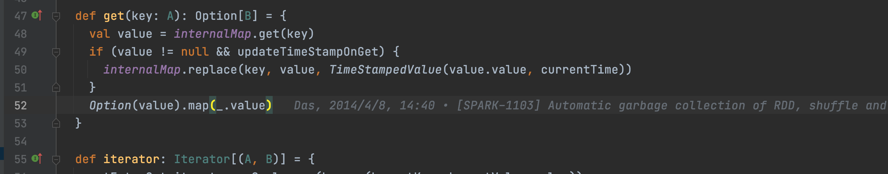
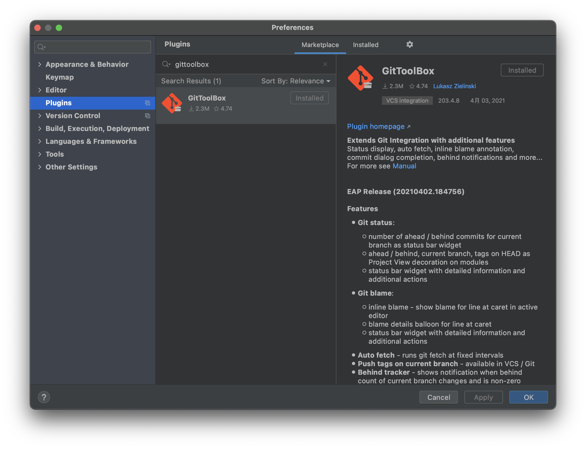
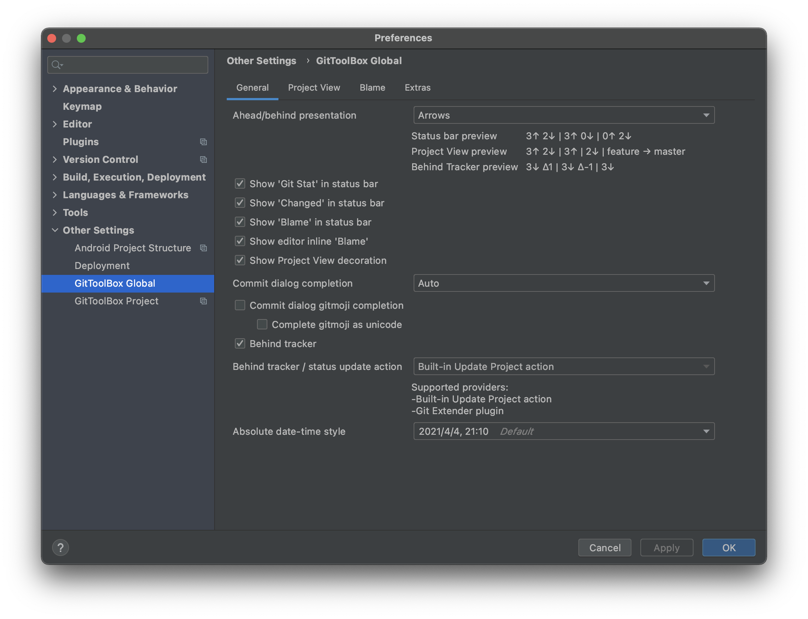
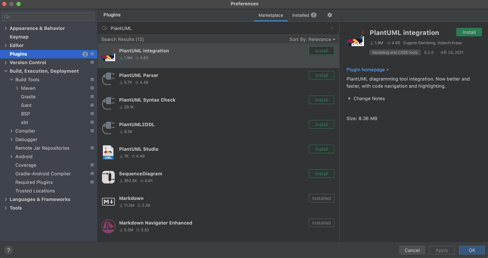
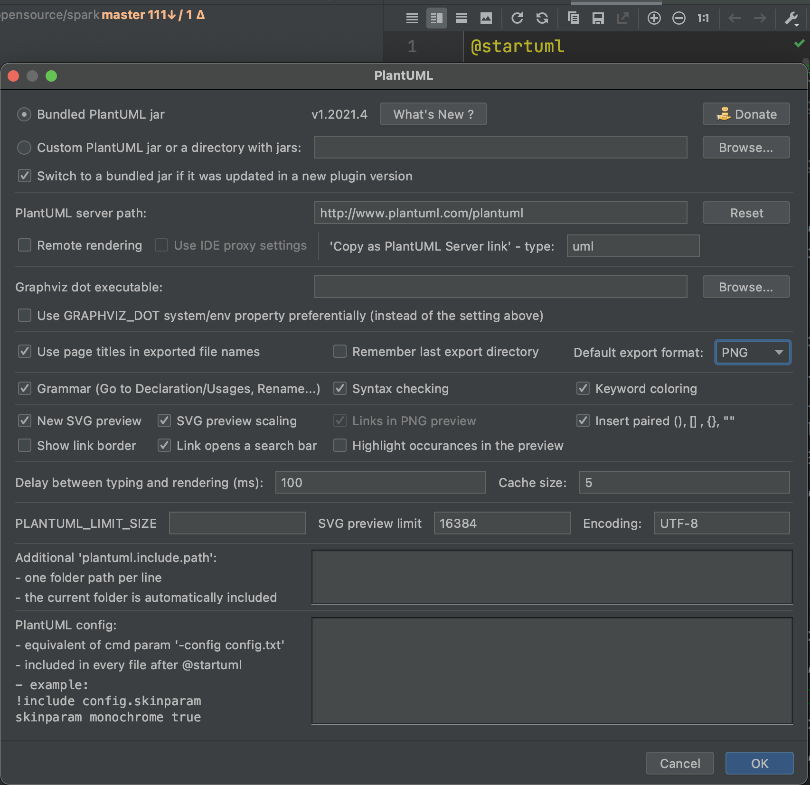

# IDEA插件

## GitToolBox

### 一、插件介绍

git工具箱，提供各种git操作。

其中比较方便的是可以即时看到每一行代码的blame



### 二、安装方式

使用IDEA下载安装



### 三、使用方式

通过以下配置




# PlantUML integration

### 一、插件介绍

PlantUML在Idea中的插件，PlantUML是一种高效绘制UML图的工具，官网：https://plantuml.com/zh/

### 二、安装方式

idea中下载，其中PlantUML Parser可以转换类图为PlantUML，PlantUML Syntax Check可以检查语法



### 三、使用方式

1. 下载Graphviz dot

官网：http://www.graphviz.org/

使用homebrew安装：

``` bash
brew install graphviz
```

速度有点慢。。

1. 配置Graphviz dot路径



## 插件名称

### 一、插件介绍

### 二、安装方式

### 三、使用方式