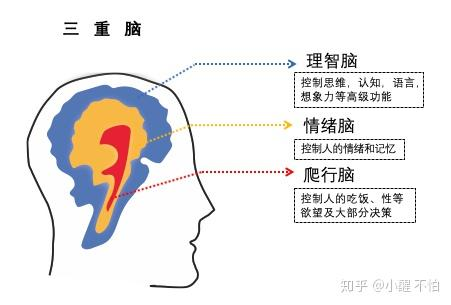
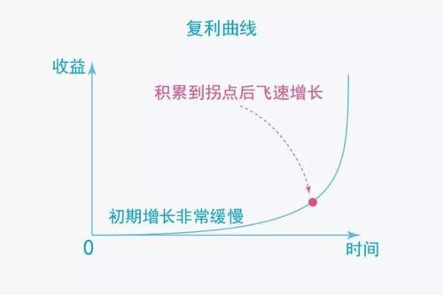
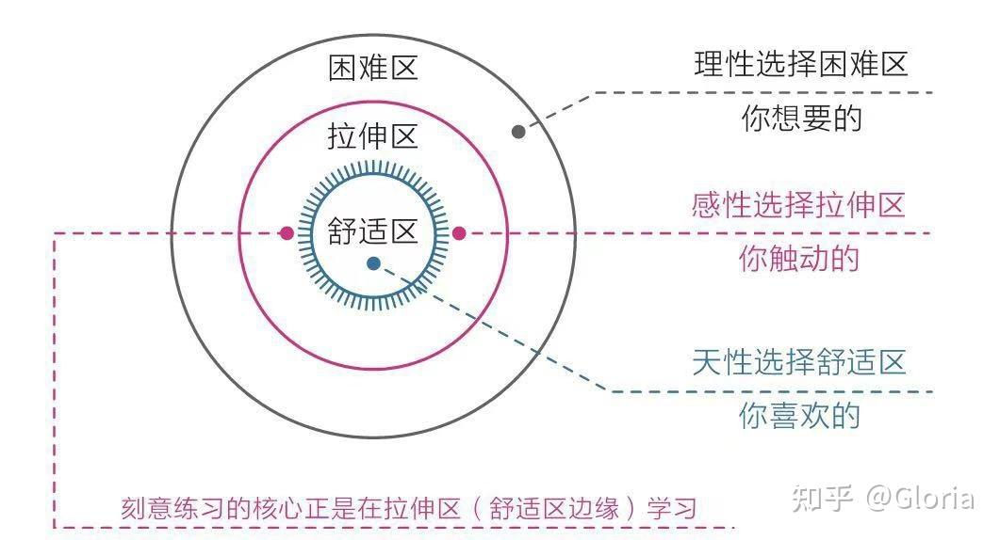
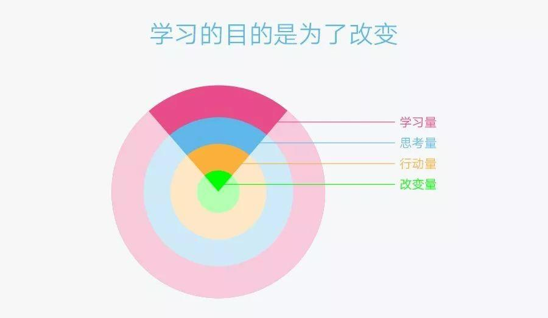
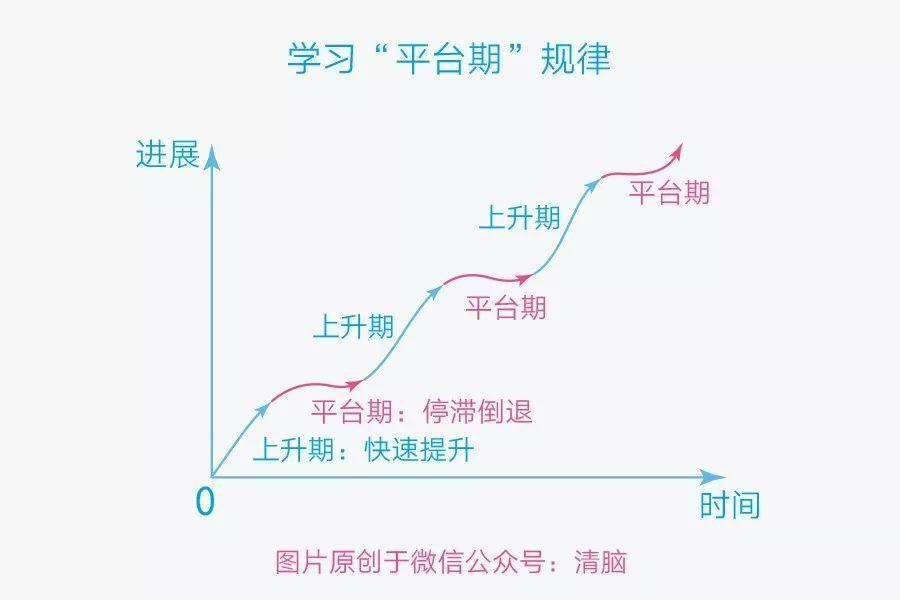

# 第一章 大脑--一切问题的根源

## 第一节 大脑：重新认识你自己

### 三重大脑

* 本能脑：爬行动物。又称爬行脑
* 情绪脑：哺乳动物。又称猴子脑
* 理智脑：人。又称思考脑

### 高低之分和权利之争

* 理智脑虽然高级，但比起本能脑和情绪脑，它的力量实在是太弱小了。
  * 第一，年龄上，本能脑有3.6亿年的历史，情绪脑有近2亿年的历史，而理智脑出现的时间不到250万年。
  * 第二，三重大脑发育成熟的时间不同，本能脑在婴儿时期就比较完善，情绪脑则要等到青春期早期才趋于完善，理智脑要等到成年早期才基本发育成熟。
  * 第三，本能脑和情绪脑拥有近八成的神经元细胞，同时它们距离心脏更近，一旦出现紧急情况，可以优先得到供血。
  * 第四，本能脑和情绪脑掌管着潜意识和生理系统，堪比当今世界上运行速度最快的个人计算机；而理智脑的最快运行速度仅为40次/秒，而且非常耗能。
* 我们在生活中的大部分决策往往源于本能和情绪，而非理智。
* 本能脑和情绪脑的基因一直被生存压力塑造着，所以它们天性自然成了**目光短浅、即时满足**。在现代社会，用**避难趋易和急于求成**来代指它们更贴切。
* 把大脑看成一个公司，理智脑就相当于经理。这样的构造导致我们陷入**明明知道，但就是做不到；特别想要，但就是得不到**的怪圈。
* **大多数时候我们以为自己在思考，其实都是在对自身的行为和欲望进行合理化**。“自我解释的动物”

### 成长就是克服天性的过程

* 只要遵循科学的方法持续练习，你就能让自己的理智脑快速变强，因为大脑和肌肉一样，遵循**用进废退**的原则。
* 习惯之所以难以改变，就因为它是自我巩固的--越用越强，越强越用。要想从既有的习惯中跳出，**最好的方法不是依靠自制力，而是依靠知识**。
* 本能脑强大的运算能力和情绪脑强大的行动能力，都是不可多得的宝贵资源。
* 理智脑不是直接干活的，干活是本能脑和情绪脑的事情，因为它们的“力气”大；**上天赋予理智脑智慧，是让它驱动本能和情绪，而不是直接取代它们**。

## 第二节 焦虑：焦虑的根源

### 焦虑之战

* 无论个体还是群体，人类的安全感都源于自己在某一方面拥有的独特优势：或能力，或财富，或权利，或影响力。
* 读书的“艰难”和买书的“惬意”简直相差了十万八千里。
* 来不及了，太晚了，一切都太晚了

### 直面焦虑

焦虑的几种形式：

* **第一，完成焦虑**。内在欲望涉及面太广或外在日程安排过紧，很难做到深入和从容。
* **第二，定位焦虑**。错误的定位让人觉得一切都来不及了，事实上，这根本就是错误的对标。
* **第三，选择焦虑**。人喜欢唯一性和确定性，面对多元和不确定，靠天生的习性怕是难以应对。
* **第四，环境焦虑**。比如家庭、工作的影响，有些事想做却做不了，还有些事不想做却必须花大量的时间去做。
* **第五，难度焦虑**。真正能让你变强的东西，其核心困难是无法回避的，不下决心与之死磕，始终在周围打转，时间越长越焦虑。

### 焦虑的根源

焦虑的原因有两条：

* **急于求成，想同时做很多的事。**
* **避难趋易，想不怎么努力就立即看到效果。**

最简单的应对方法就是反着来，比如：

* 克制欲望，不要让自己同时做很多事；
* 面对现实，看清自己真实的能力水平；
* 要事优先，想办法只做最重要的事情；
* 接受环境，在局限中做力所能及的事；
* 直面核心，狠狠逼自己一把去突破它。

## 第三节 耐心：得耐心者得天下

* 人类天性中最原始、最本能的部分--**及时满足**。

* 人们对耐心这个概念的理解普遍倾向于忍受无趣、承受痛苦、咬牙坚持、硬抗到底。

### 缺乏耐心是人类的天性。

* 社会中的精英通常是那些能更好地克服天性的人，他们的耐心水平更高，延迟满足的能力更强。

### 认知规律、耐心的倍增器

#### 复利曲线

  

* 复利曲线体现了价值积累的普遍规律：**前期增长非常缓慢，但到达一个拐点后会飞速增长**。
* 选择正确的方向，并在积累的过程中遵循刻意练习的原则，在舒适区的边缘一点一点地扩展自己的能力范围。

#### 舒适区边缘

* 想要让自己高效成长，必须让自己始终处于舒适区的边缘，贸然跨到困难区会让自己受挫，而始终留在舒适区会让自己停滞。

* 人的天性正好相反，在欲望上急于求成，在行动上避难趋易。

#### 成长权重对比

* 成长权重对比：改变量>行动量>思考量>学习量。

#### 学习的平台区

* 学习进展和时间的关系并不是我们想象中的那种线性关系，而是呈现一种波浪式上升曲线。
* 当我们清楚了上述规律之后，就能在面对长期的冷寂或者挫折失败时做出与他人不同的选择：有人选择放弃，而我们继续坚持。

**耐心不是毅力带来的结果，而是具有长远目光的结果**

### 怎样拥有耐心

* 面对天性，放下心理包袱，坦然接纳自己。

* 面对诱惑，学会延迟满足，变对抗为沟通。

* 面对困难，主动改变视角，赋予行动意义。

  * 让本能脑和情绪脑出动来解决困难。

  