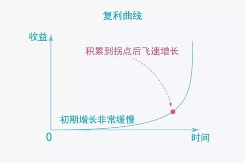
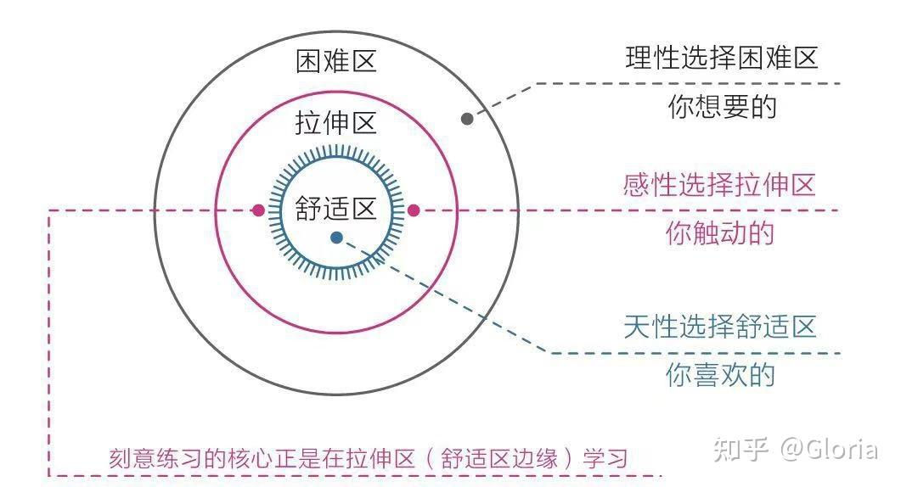
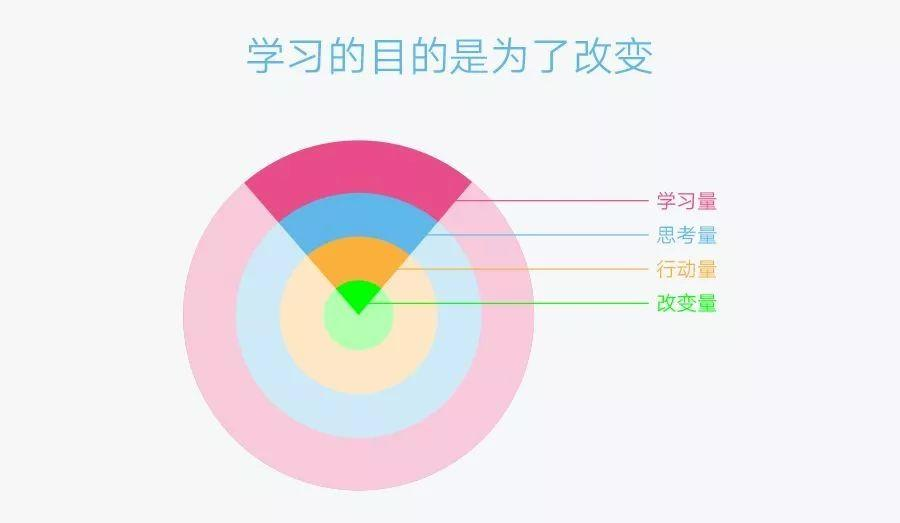
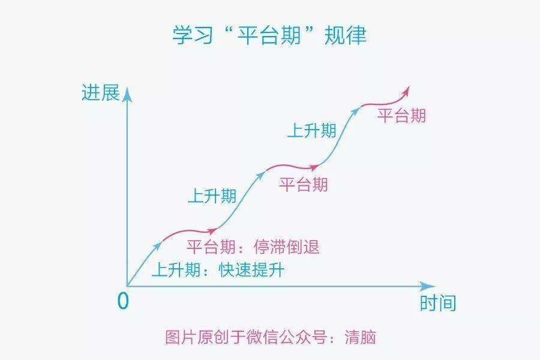

# 第一章 大脑--一切问题的根源

## 第一节 大脑：重新认识你自己

## 第二节 焦虑：焦虑的根源

## 第三节 耐心：得耐心者得天下

* 人类天性中最原始、最本能的部分--**及时满足**。

* 人们对耐心这个概念的理解普遍倾向于忍受无趣、承受痛苦、咬牙坚持、硬抗到底。

### 缺乏耐心是人类的天性。

* 社会中的精英通常是那些能更好地克服天性的人，他们的耐心水平更高，延迟满足的能力更强。

### 认知规律、耐心的倍增器

#### 复利曲线

  

* 复利曲线体现了价值积累的普遍规律：**前期增长非常缓慢，但到达一个拐点后会飞速增长**。
* 选择正确的方向，并在积累的过程中遵循刻意练习的原则，在舒适区的边缘一点一点地扩展自己的能力范围。

#### 舒适区边缘

* 想要让自己高效成长，必须让自己始终处于舒适区的边缘，贸然跨到困难区会让自己受挫，而始终留在舒适区会让自己停滞。

* 人的天性正好相反，在欲望上急于求成，在行动上避难趋易。

#### 成长权重对比

* 成长权重对比：改变量>行动量>思考量>学习量。

#### 学习的平台区

* 学习进展和时间的关系并不是我们想象中的那种线性关系，而是呈现一种波浪式上升曲线。
* 当我们清楚了上述规律之后，就能在面对长期的冷寂或者挫折失败时做出与他人不同的选择：有人选择放弃，而我们继续坚持。

**耐心不是毅力带来的结果，而是具有长远目光的结果**

### 怎样拥有耐心

* 面对天性，放下心理包袱，坦然接纳自己。

* 面对诱惑，学会延迟满足，变对抗为沟通。

* 面对困难，主动改变视角，赋予行动意义。

  * 让本能脑和情绪脑出动来解决困难。

  