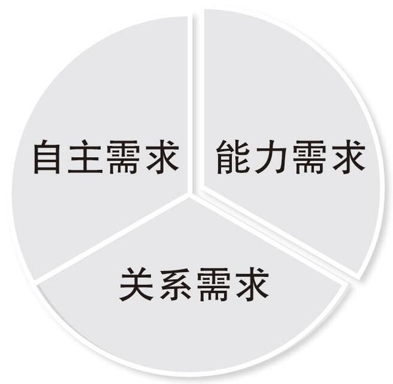

# 第七章 情绪力--情绪是多角度看问题的智慧

## 第一节 心智带宽：唯有富足，方能解忧

### 稀缺心态，让人变笨

* 在一定的前提下，**贫穷确实会使人变笨**，这不是因为贫穷让人能力不足，而是贫穷造成的稀缺俘获了人的注意力，进而降低了人的心智带宽。
* **任何能制造压力的事件都会挤占我们的心智带宽**。
* 只要我们的注意力被某一个巨大的事物吸引，我们就有可能进入稀缺状态，进而降低心智带宽，做出不明智的行为。
* “恋爱中的男女智商为零”。

### 急于求成，焦虑丛生

* 现代社会虽然给我们提供了更多便利和选择，同时也带来了前所未有的快节奏，这不由得迫使每个人加快脚步，不自觉地想要更多优势。
* 另外一种现象：很多同学或职场人希望在假期或空闲时间提升自己，于是把日程安排得满满当当，不留一丝余地，结果每次都是“**理想很丰满，现实很骨感**”。
* **当一个人同时面临很多任务的时候，他的心智带宽就会降低，反而没有了行动力和自控力**。
* 现代生活虽然缓解了生存压力，却又带来了自控上的压力。抵制诱惑和欲望无一不消耗我们的心智带宽。

### 唯有心智富足，方能解忧

* 第一贴，**保持环境觉知，理智选择**。
  * 为了在压力环境中尽可能保持较大的格局和远见，运用高级元认知能力保持对环境的觉知。
* 第二贴，**保持目标觉知，少即是多**。
  * 站在一生的高度去审视自己真正要做的是什么，然后打破思维定式，拒绝所有那些即使不去做天也不会塌下来的事情。
* 第三贴，**保持欲望觉知，审视决策**。
  * 脑子里存在大量任务和念头的时候，往往是我们行动力最弱的时候。
  * 真正的行动力高手不是有能耐在同一时间做很多事的人，而是会想办法避免同时做很多事的人。
* 第四贴，**保持情绪觉知，谨慎决定**。
  * 不要在最兴奋的时候做决定，也不要在最愤怒的时候做决定，尤其是重大决定。
* 第五贴，**保持闲余觉知，自我设限**。
  * 适当的闲余是我们应对压力和意外的宝贵资源，但过多的闲余可不是什么好事。

## 第二节 单一视角：你的坏情绪，源于视角单一

* 在面对各种困境的时候，多角度看问题的能力往往是考验解决问题能力的关键。
* 它不仅能帮助人们获取智慧、成就事业，还能帮助人们在生活中拓展格局、化解烦恼。

### 世界是多维的，而我们只有一双眼睛

* 世界上任何一个人、任何一件物，任何一件事都是多维立体的。
* 一个人的性格和脾气好不好，也取决于他多角度看问题的能力：**视角单一的人容易固执、急躁和钻牛角尖，而视角多元的人则表现得更为智慧、平和与包容**。
* 我们接触的观点、方法通常只适用于特定的角度或范围。

### 成为一台更好的相机

* 用相机来理解多视角，**不只是角度的差别，它还包含了另一层含义--相机本身的差别**。
* 我们一定要保持觉知，要清醒地意识到自己的视角偏差，时刻做好向上升级、向下兼容的准备。拥有这种心态，不仅我们自己能越来越完善，还能与其他人都合得来。

### 总有一个更好的视角

* **不要被原始视角束缚，主动转换视角可能会看到一个新天地**。
* 只是有的人面对再好的事情时都盯着一点瑕疵不放，而有的人却能从任何一件糟糕的事情中找到闪光点并放大，忽视其他不足之处。

### 大师修炼之路

> 《反本能》当我们长期进行一种行为的时候，大脑会慢慢形成一个专门处理这个行为的“绿色通道”，所以当自己面临相似场景时，大脑会对这种行为进行优先选择，并进一步形成自动化反应。

* 一是**勤移动**。
  * 假设自己时一个局外人，用第三视角来观察自己。
* 二是**善学习**。
  * 借助高人的视角来观察世界。
* 三是**要开放**。
  * 很多人情绪不好，是因为他们把自己做的假设当成了事实，在不确定对方真实想法的情况下，直接把情绪发泄了出来。
  * 想要情绪平和，就是要在交流时不戴有色眼睛，不带主观色彩，先想办法了解事实，搞清楚对方到底是怎么想的，这一点非常重要。
  * 我对任何人，一般都先假设他是正直、善良和诚信的。
* 四是**寻帮助**。
  * 当我们对情绪问题或工作问题百思不得其解的时候，不要一个人闷头苦想，要学会主动寻求外部帮助，借助他人的多维视角来克服自己单一视角的局限。
* 五是**多运动**。
  * 适当的有氧运动会提升我们体内多巴胺的水平，而多巴胺对于创造力和多角度思考能力来说都很重要。
* 六是**常反思**。
  * 你的笔和键盘都能帮你跳出单一视角，看到更多维度。

## 第三节 游戏心态：幸福的人，总是在做另外一件事

不要让事情本身束缚了你的情绪和注意力。

### 幸福源自主动掌控

* “自我决定理论”：人类有三种天生的内在需求：关系需求、能力需求和自主需求。

一个人想要生活幸福，需要具备一下因素：

* 有良好的**人际关系**，得到别人的爱与尊敬；
* 有独特的**本领、技能**，为他人带去独特价值；
* 有**自主选择**的权力，能做自己想做的事情。

特别是“自主需求”，它是自我决定理论的关键与核心。我们如果能主动选择和掌控所做的事情，就会产生内在动力，获取幸福。

* **困难和压力总能把人的情绪和注意力抓得死死的，让你很难看到其他角度**。
* 任何事物都是多维的，立体的。

### 只是在做另外一件事

* 当你遇到那些“不想做但必须做”的事情时，心里默念：**我并不是在做这件事，我只是在做另外一件事**。
* 事情本身不重要，我们只是在通过它获取另外一种乐趣，顺便把这件事给做了。
* 缺乏觉知的人，其行事动机常常由外部事物牵引，少有自主选择和掌控的余地，容易陷入“为做而做”的境地。
* 有觉知的人会适时觉察自己的行事动机是否停留在与目标任务无关的外部事物上，会想办法将其转移到内部，这种掌控的窍门分为两类：为自己而做和为玩而做。

### 为自己而做

* 产生内部动机最好的方式莫过于**立足于让自己变好**。
* 华为公司之所以坚持不上市，就是不希望企业的发展动机被外部力量控制。
* 对内在动机更敏感和坚持的人，不会为外界的奖励和评价而刻意表现，只会**为自己的成长和进步而努力进取**，这样的人很难被困难击倒。

### 为玩而做

* **为自己而做，通常是为了应对外部的压力和要求，为玩而做，则是为了应对重复、枯燥的事情**。
* 胡适：怕什么真理无穷，进一寸有进一寸的欢喜。

### 这个世界的模样取决于我们看待它的角度

* 人是自我解释的动物，世界的意义是人类赋予的。
* **为自己而做可以解放情绪，为玩而做可以解放注意力**。

