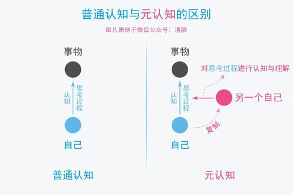
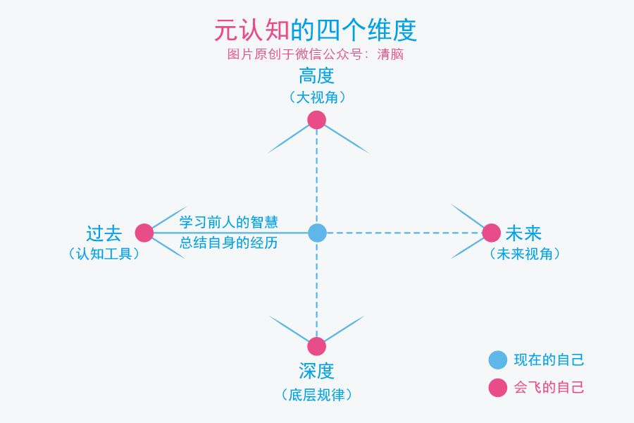
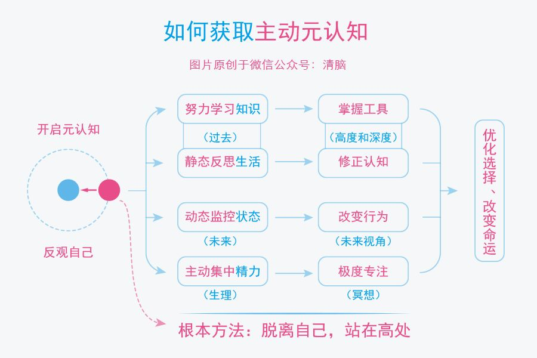

# 第三章 元认知--人类的终极能力

## 第一节 元认知：成长慢，是因为你不会飞

### “万物之灵”的根源

**它能对自身的“思考过程”进行认知和理解**。

### 元认知能力的差异

* 被动元认知：在遇到问题时被迫启用这个能力。
* 主动元认知：在没有威胁的情况下也会尝试进化，彻底脱离危险。

### 元认知如何改变我们的命运

你能意识到自己在想什么，进而意识到这些想法是否明智，再进一步纠正那些不明智的想法，最终做出更好的选择。

### 如何获取元认知能力

1. 提升元认知能力的工具需要从“过去”端获取，包括学习前人的智慧和反思自身的经历。
2. 自身的经历更是一种独特的财富。曾子：“每日三省吾身”。
3. 如何启用元认知，启用你的“灵魂伴侣”。
   1. 灵魂伴侣一直监控你，帮助你审视自己的行为，从过程中跳出来。
   2. 让你从高处俯瞰全局。
   3. 未来视角总是当前行动的指南针。
4. 提高元认知能力的方法--冥想。监控自己的注意力，然后将其集中在自己需要关注的地方。

掌握元认知能力并不容易，需要不断的练习、练习、再联系，变化也是反馈，收集这些反馈，然后继续激励自己。

## 第二节 自控力：我们生而为人就是为了称为思维舵手

元认知能力就是觉察力和自控力的组合。

元认知能力可以被重新定义为：**自我审视、主动控制、防止被潜意识左右的能力**。

### 我们天然被潜意识左右

* 我们立下的目标大多是受大环境影响而跟风设定的--别人说好，自己也想要，但实际上自己并不需要。

### 成长就是为了主动控制

* 随着长大，理智脑的战斗郦才慢慢增强。
* 理智脑的战斗力表现在两方面：一方面是**侧重学习、理解、记忆、运算的认知能力**；另一方面则是**侧重观察、反思、判断、选择的元认知能力**。
* 学校里集中锻炼了认知能力，但是对元认知的锻炼却很少涉及。
* 主动锻炼自己的元认知能力，让理智脑更多地参与大脑的决策，掌握大脑的主导权。
* 主导权易手的过程中，表现出的明显特征是：**能够主动控制注意力，不能被随机、有趣的娱乐信息随意支配**。
* 每当遇到需要选择的情况时，我们要是能先停留几秒思考一下，就有可能激活自己的理智脑，启用元认知来审视当前的思维，然后做出不一样的选择。
* 锻炼的好方法：**一定要在选择节点上多花“元时间”**；

### 成为自己人生的思维舵手

* 元时间通常分布在“选择的节点”，善用这些时间会极大程度地优化后续时间的质量。在元时间内就做一件事：想清楚。
* 在选择的节点审视自己的第一反应，并阐述清晰明确的主张。
* 元认知能力强的一个突出表现是：**对模糊零容忍**。
* 自己行动力弱的时候，脑子里对未来的具体行动肯定是模糊不清的。
* 焦虑的人很少有“元时间”的意识，他们习惯不动脑子、直接行动，喜欢用饱和的行动来感动自己。

成为思想舵手有3种方法：

* 针对当前下的时间，保持觉知，审视第一反应，产生明确的主张。
* 针对全天的日程，保持清醒，时刻明确下一步要做的事情。
* 针对长远的目标，保持思考，想清楚长远意义和内在动机。

高尔基：每一次克制自己，就意味着比以前更强大。