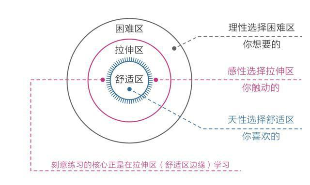

# 第二章 潜意识--生命留给我们的彩蛋

## 第一节 模糊：人生是一场消除模糊的比赛

* 意识分层让潜意识负责胜利系统，让意识负责社会系统。
* 模糊：意识很难介入潜意识，而潜意识却能轻易左右意识。

### 学习知识，消除认知模糊

* 学习知识的目的是“消除模糊”，而获取知识的方法也是“消除模糊”，目的和方法相统一。
* 《思考力》《刻意练习》《原则》《超越感觉》
* 提升思考能力的方法正是不断明确核心困难和新的感悟，并专注于此。
* **谁更愿意做高耗能的事--消除模糊，制造清晰**。

### 拆解烦恼，消除情绪模糊

* 德国心理治疗师伯特·海灵格：受苦比解决问题来的容易，承受不幸比享受幸福来得简单。
* 具体事件一旦变得模糊，其边界就会无限扩大，原本并不困难的小事，也会在模糊的潜意识变得难以解决。
* **要想不受痛苦事件困扰，唯一的办法就是正视它、看清它、拆解它、化解它**。
  * 到底是什么让自己烦躁不安
  * 具体是什么让自己恐惧担忧
  * 面对困境，我能做什么？不能做什么？如果做不到或者搞砸了，最坏的结果是什么？
* 恐惧就是一个欺软怕硬的货色，你躲避它，它就张牙舞爪，你正视它，它就原形毕露。

### 里清外明，消除行动模糊

* 行动力不足的真正原因是选择模糊。
* 当我们没有足够清晰的指令或者目标时，就很容易选择享乐，放弃那些本该坚持但比较烧脑的选项。
* **我们要把目标和过程细化、具体化，在诸多可能性中建立一条单行通道，让自己始终处于“没得选”的状态**。

## 第二节 感性：顶级的成长竟然是“凭感觉”

* 凭感觉--察觉潜意识发出的信息
* 成甲《好好学习》

### 凭感觉学习

* 凡是被某件事击中，“动了感情”，就要有意识地提醒自己追问原因。
* 先用感性能力帮助自己选择，再用理性能力帮助自己思考。
* 那些一眼能看出答案的题目，不用理它；一眼看过去就头痛、不知道在说什么的题目，也不用理它；只有那种大致能看出点思路，但又要动点脑筋的题目，一定要多做。
* “凭感觉”之所以被称为顶级的方法，是因为它能帮我们感知真正适合自己并需要的东西，让自己处于学习的“拉伸区”；
* 读书--只取一个全书最触动自己的点，然后尽可能去实践、改变。这样读书不仅能收获更大，而且也不会焦虑。

### 凭感觉寻找人生目标

* 目标是存放我们热情和精力的地方。
* 用心去感受什么事情让自己最触动，而不是用脑去思考什么事情最有利。

### 如何捕捉感性

1. “最”。最触动自己的点
2. “总”。总不自觉地跳出来的某些重复年头
3. 无意识的第一反应。
4. 梦境。梦境是潜意识传递信息的一种方式。
5. 身体。
6. 直觉。