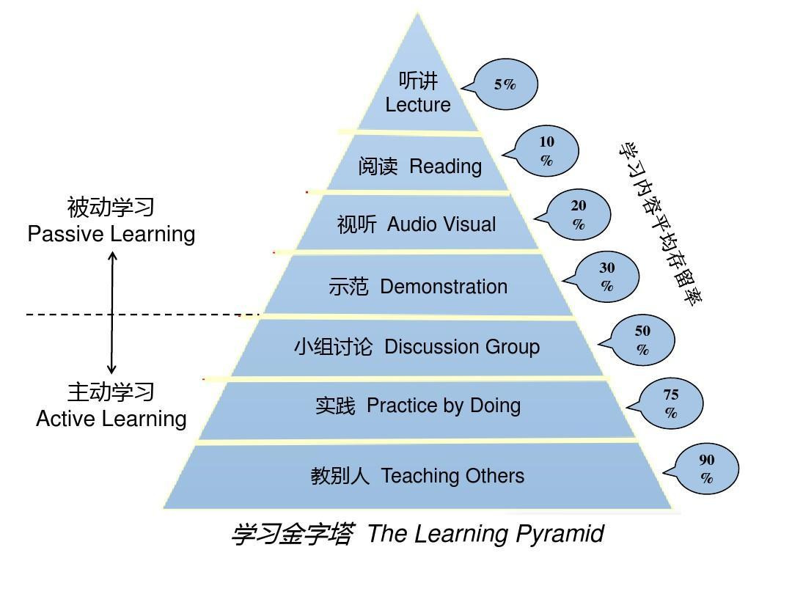
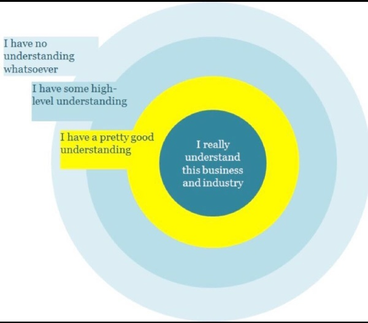

# 第五章 学习力--学习不是一味地努力

## 第一节 匹配：舒适区边缘，适用于万物的方法论

刻意练习真正的核心不是深度沉浸，而是难易匹配。

### 好的成长是始终游走在“舒适区边缘”

* “主动做”和“靠意志力做”不一样。
* 找一个自己能坚持做下去的方式，比单纯按照标准化的时间额方式做更重要。
* 既不要太难，也不要太容易，难易适中的地带才是学习的心流通道。
* 我们应该花大量的时间去梳理哪些内容处在自己的拉伸区，即梳理哪些“**会做但特别容易错或不会做但稍微努力就能懂**”的内容，然后在这个区域内努力。

### 距离太远的，我们都把握不住

* 距离我们太远的事物，我们通常无法把握，无论它们是令人痛苦的还是令人享受的。
* **做选择是一件极为耗能的事情**。理想的状态是持续获取与自己当前能力相匹配的财富或者自由。
* 只要能昂自己处在舒适区的边缘持续练习，你的舒适区就会不断扩大，拉伸区也就会不断扩展，原先的困难区也会慢慢变成拉伸区，甚至是舒适区，所以**成长是必然的**，也可以肯定：**速成是不可能的**。

### 一切为了匹配

* 目标，行动遇阻时细想就会发现，其根源都是一样的，那就是**问题太大、太模糊**。
* 拆解目标，几乎所有的行动达人都是拆解任务的高手。
* 从舒适区到拉伸区的策略：**提炼目标**。
* 在拉伸区练习的一大特点就是**要有关注点**。比如练习题只练出错最多的地方，比如背单词不是一遍一遍的重复，而是看完后合上书就行自我测试，把出错的单词找出来，然后不停的重复记这些出错的单词，直到全部掌握。
* 通过自我测试，反思，错题本这些方式获得反馈，不断的优化自己关注的要点和小目标。

## 第二节 深度：深度学习，人生为数不多的好出路

丰富的信息和多元的方式带来便捷的同时，也深深地损耗着人们深度学习的能力，并且这种倾向越来越明显。

### 何为深度学习

* 埃德加·戴尔 “学习金字塔”理论

* 阅读金字塔：听书、自己读书、自己读书+摘抄金句、自己读书+思维导图/读书笔记、自己读书+践行操练、自己读书+践行操练+输出教授。
* 听书：看似轻松高效，实则处于被动学习的最浅层。
* 读原书：读完从不回顾、思考，只满足于输入的过程，知识的留存率很低。这是低水平的勤奋，投入越多损失越大。
* 自己阅读，也做读书笔记或思维导图：只是简单的知识陈述、与高级别的知识转换有很大的不同。
* 实践书中的道理：**从知道到做到时一种巨大的进步**，明明心里想得挺明白，讲的时候就开始语无伦次了，写的时候更是无从下笔。
* 动用已有的知识去解释新知识，当能把新学的知识解释清楚时，就进入了**深度学习**，比如，写阅读心得就是逼迫自己原来的知识结构对新知识做出反应，然后把这些反应用文字固化下来，大多数人只完成了“获取知识”，却忽略了**“缝接知识”**这一步。
* 浅度学习满足输入，深度学习注重输出。
* 逼迫自己获取高质量的知识以及深度缝接新知识，再用自己的语言或文字教授他人，是为深度学习之道。

### 如何深度学习

深度学习有三个步骤

1. **获取早质量的知识；**
2. **深度缝接新知识；**
3. **输出成果去教授。**

> 一开始你认为难受和困难的事才能让你真正产生收获。

* 一是尽可能获取并亲自钻研一手知识。

* 二是尽可能用自己的话把所学的知识写出来。

  > 当一个你精心打磨的作品打动了别人，它产生的影响力将远比每天都写但缺乏深度的思考要大得多。

* 三是反思生活。

  > 人与人之间的差距来自经验总结、反思和升华的能力。

### 深度学习的好处

* 深度学习处理能让我们**不再浮躁，能磨练理智**，还能带来诸多好处，比如跨界能力的提升。
* 深度学习还能让人**产生更多灵感**。
* 深度学习还能让我们**看到不同事物之间更多的关联，产生洞见**。
* 深度学习下的**广度**才是有效的。

### 为浅学习正名

* **专注**于深度学习，同时对浅学习**保持开放**。
* 选择一些值得关注的人，和他们保持联结，他们释放的一些有价值的信息会引领我们走向更广阔的世界。

## 第三节 关联：高手的“暗箱”

大师创作的普遍手法--把远处不起眼的A，关联到近处需解决的B，然后爆发出惊人的力量。

### 无关联，不学习

* 知道信息点
* 关联信息点
* 行动和改变

不管这个新知识让人多警醒、使人多震撼，若是无法与已有的知识发生足够的关联，它存活不了多久。

获取新知->关联新知->形成晶体

绝大多数人习惯以孤立的思维看待事物，喜欢花大量时间收集和占用信息；而另一批先行者则更喜欢拨弄信息之间的关联，从而在不知不觉间变得聪明起来。

### 事不关己，不关联

* 知识的获取不在于多少，而在于是否与自己有关联，以及这种关联有多充分。
* 还有一个更重要的条件不能忽视：你需要明确的目标或者强烈的需求。

### 如何获取关联能力

* **首先，手中要有锤子**。比如作者手中有了写作这把“锤子”，过去的故事才能被想起。
* **其次，输入足够多**。知识阅历越丰富，成功关联的概率越大。
* **再次，保持好奇心**。越不起眼的小事越有可能通过关联产生至深的启发。
* **最后，常说一句话**。“这个道理还能用在什么地方？” 想办法把知识和触动效率最大化。

### 一切在于主动

从今日起，请你重新认识它，主动运用它、传递它，让它不再隐藏、不再模糊。

## 第四节 体系：建立个人认知体系其实很简单

要是一个人拥有的知识体系可以解决自己遇到的各种问题，那他必定是个厉害的人。

### 知识和认知的区别

* 并不是说实用的知识才是知识，而是说，只有知识能够帮助你做实际决策的时候，它才是你的知识。
* 个人成长的目的已经不是“知道和理解”，而是“判断和选择”。
* **在个人成长领域，没有最优、最稳定、最权威的认知体系，只有最适合我们当前状态的认知体系**。
* 知识不一定能给我们带来认知能力，而认知能力必然包含有效的知识。

### 只学让自己触动的

* 初学者有一个共同的特点：**非常在意形式上的完整**。比如读完一本书，系统地梳理作者的知识框架，比如读书笔记，摘录精华，画思维导图。
* 阅读时，唯一要做的事情：**寻找触动点**。可能是一个理论，一个案例，甚至是一句话，只有真正打动和产生真实的改变，这本书就超值了。
* 能力圈法则

> 除非对方的认知体系刚好和自己的认知圈比较匹配，否则痴迷于全盘接受，学习效果有限，还很浪费时间。

* 体系的本质是用独特的视角将一些零散的、独立的知识、概念或者观点整合为应对这个世界的方法和技巧。
* 打碎各家的认知体系，只取其中最触动自己的点或块，然后将其拼接成自己的认知网络。

### 触动是最好的筛选器

* 通过情绪触动，识别与自身需求结合最紧密的内容。
* 紧紧抓住这些内容就可以让自己处于舒适区边缘，高效学习、快速提升。

### 仅仅触动还不够

* 产生“触动”不意味着“连接”紧密
* 有效关联新知识的三个方面
  * 一是**用自己的语言重新解释**新知识，这会儿促使自己原有的知识体系对新知识做出反应。
  * 二是**在需要的时候能够顺利提取**知识，提取不出来的知识就是伪触动。
  * 三是**在生活中能够经常练习或使用**这些知识，因为实践是产生强关联的终极方法。
* 本质：在舒适区边缘，一点一点向外扩展。

## 第五节 打卡：莫迷恋打卡，打卡打不出未来

### 动机转移，动力扭曲

* 学习很难，但打卡并不难！只要完成打卡，不就代表任务已经完成了吗？
* 大多数人在意志力薄弱的情况下，都会**为了完成打卡任务而不自觉地降低标准**，此时做多做少、做好做坏已然不是最重要的，最重要的是完成打卡任务。

### 认知闭合，效能降低

* 认知闭合需求，就是指当人们面对一个模糊的问题时，就有给问题找出一个明确的答案的欲望。
* **一件事若迟迟没有完成，心里就总是记挂，期盼着早点结束；此事一旦完成，做这件事的动机就会立即趋向于零**。
* 打卡心态的特性：学不到，假装一下；学到了，立即停止。

### 任务心态，身心分裂

* 在个人学习成长领域，任务心爱或许并不可取。
* 不管什么时候，身后好像总有一个声音在不停地催促：快点、快点、再快点，赶快完成它。
* **个体生命的本质意义在于身心合一，去觉知真实的生命过程**。在学习时，身心合一、极度专注时极为重要的前提条件，只有在这种状态下，人们才能从学习活动中收到精细、强烈的正向反馈。
* 破除任务心态的方法--集中心力做眼前的事就好。

### 两个策略，轻松改变

* 很多时候打卡是一个很好的工具，它确实能助推我们持续行动，形成行动惯性，**切不可完全依赖打卡，打卡只是学习活动的附属品**。
* **一个小方法：用记录代替打卡**。看起来跟打卡一样，但这样做没有打卡的任务压力，可以将注意力集中到活动本身。
* 无须担心缺少打卡的限制使自己懈怠，只要专注于学习成长活动本身，体会其中的乐趣，就能保持强烈的学习动机，化被动学习为主动学习。
* 在任务设置是使用新策略：**设下限，不设上限**。
* 这种策略的智慧之处在于规避了任务闭合需求，只要觉得有意思，你就可以一直学下去，直至自己觉得有些吃力。
* 这个策略来自于《微习惯》。
* 对于学习而言，保持内在的动机最重要。

