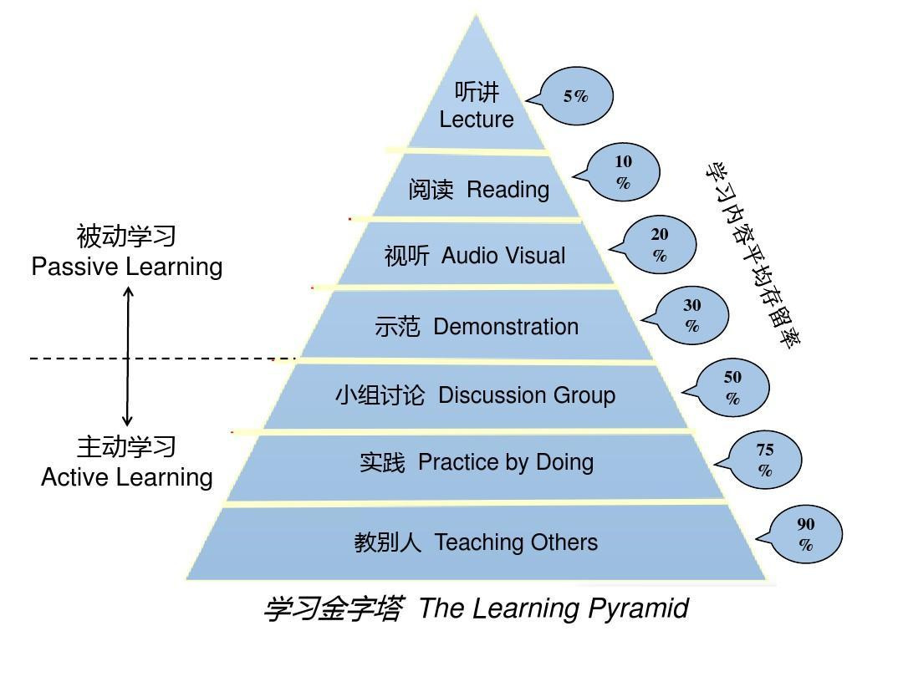

# 第五章 学习力--学习不是一味地努力

## 第一节 匹配：舒适区边缘，适用于万物的方法论

刻意练习真正的核心不是深度沉浸，而是难易匹配。

### 好的成长是始终游走在“舒适区边缘”

* “主动做”和“靠意志力做”不一样。
* 找一个自己能坚持做下去的方式，比单纯按照标准化的时间额方式做更重要。
* 既不要太难，也不要太容易，难易适中的地带才是学习的心流通道。
* 我们应该花大量的时间去梳理哪些内容处在自己的拉伸区，即梳理哪些“**会做但特别容易错或不会做但稍微努力就能懂**”的内容，然后在这个区域内努力。

### 距离太远的，我们都把握不住

* 距离我们太远的事物，我们通常无法把握，无论它们是令人痛苦的还是令人享受的。
* **做选择是一件极为耗能的事情**。理想的状态是持续获取与自己当前能力相匹配的财富或者自由。
* 只要能昂自己处在舒适区的边缘持续练习，你的舒适区就会不断扩大，拉伸区也就会不断扩展，原先的困难区也会慢慢变成拉伸区，甚至是舒适区，所以**成长是必然的**，也可以肯定：**速成是不可能的**。

### 一切为了匹配

* 目标，行动遇阻时细想就会发现，其根源都是一样的，那就是**问题太大、太模糊**。
* 拆解目标，几乎所有的行动达人都是拆解任务的高手。
* 从舒适区到拉伸区的策略：**提炼目标**。
* 在拉伸区练习的一大特点就是**要有关注点**。比如练习题只练出错最多的地方，比如背单词不是一遍一遍的重复，而是看完后合上书就行自我测试，把出错的单词找出来，然后不停的重复记这些出错的单词，直到全部掌握。
* 通过自我测试，反思，错题本这些方式获得反馈，不断的优化自己关注的要点和小目标。

## 第二节 深度：深度学习，人生为数不多的好出路

丰富的信息和多元的方式带来便捷的同时，也深深地损耗着人们深度学习的能力，并且这种倾向越来越明显。

### 何为深度学习

* 埃德加·戴尔 “学习金字塔”理论

* 阅读金字塔：听书、自己读书、自己读书+摘抄金句、自己读书+思维导图/读书笔记、自己读书+践行操练、自己读书+践行操练+输出教授。
* 听书：看似轻松高效，实则处于被动学习的最浅层。
* 读原书：读完从不回顾、思考，只满足于输入的过程，知识的留存率很低。这是低水平的勤奋，投入越多损失越大。
* 自己阅读，也做读书笔记或思维导图：只是简单的知识陈述、与高级别的知识转换有很大的不同。
* 实践书中的道理：**从知道到做到时一种巨大的进步**，明明心里想得挺明白，讲的时候就开始语无伦次了，写的时候更是无从下笔。