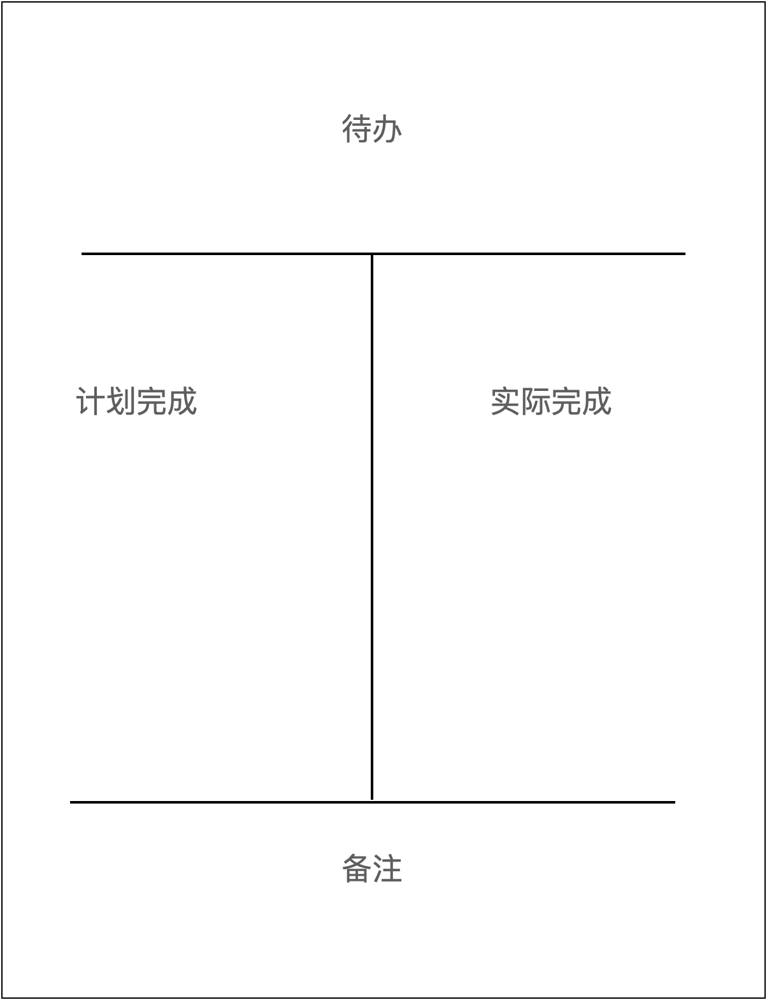

# 第六章 行动力--没有行动，世界只是个概念

## 第一节 清晰：一个观念，重构你的行动力

与天性对抗是没有出路的，真正的行动力并不完全来源于自制力。

### 珍惜每天的礼物

* 每天早上醒来，我们都会收到一份礼物--纯净的注意力。
* 世界上有一个底层的系统规律叫“增强回路”，注意力的使用同样遵循这个规律，**最初的选择会影响行为自动增强的方向**。
* **注意力的增强回路是正向还是负向的，很大程度上取决于你最初的选择**，这也是老生常谈的道理：要事第一。
*  在增强回路的起点，做出有利选择所消耗的自制力是最小的，如果等负的增强回路形成，再想改变就难了。
*  在初始阶段，强迫自己先做重要的事情，一旦进入正向的增强回路，你便能拥有强大的行动力--这正是增强自制力、提升行动力的秘密。

### 清晰力才是行动力

* 一切都只知道个大概，这对提升行动力来说，是很致命的。
* 清晰力，也就是把目标细化、具体化的能力--行动力只有在清晰力的支撑下才能得到重构，

### 一招建立清晰力

* 清晰力的建立--**写下来**。
  * 待办事项
  * 计划完成
  * 实际完成
  * 备注

* 做规划的目的并不是让自己严格的按计划执行，只是为了让自己心中有数。

### 成长是一个系统工程

* 不要把一个方法视作救命稻草。
* 从某种程度上说，**有自己热爱的事，比行动力本身要重要得多**。

### 一切源于“想清楚”

* 你陷入怠惰、懒散、空虚的情绪中动弹不得时，往往是因为你的大脑处于模糊状态。
* 认知越清晰，行动越坚定。
* **在普通人眼里是“知易行难”，在聪明人眼里是“知难行易”**。

## 第二节 “傻瓜”：这个世界会奖励那些不计得失的“傻瓜”

* 一是凡事必须在看到明确的结果后才行动，如果前景不确定、不明朗，即使别人说得再有道理，我也不愿意投入。
* 二是如果一个道理或方法不能让自己快速发生变化，就不是最优的，所以要不断寻找，这样才有希望找到最好的方法。

### 成长中的悖论

* 傻傻地敲键盘，傻傻地写文章，让作者看到了创造文字的好处，进而主动的做成了这件事。
* **想先看到结果再行动的人往往无法看到结果。**
* 只要道理正确，就别在乎那些小聪明，带着不计得失的心态往前走，你会发现目标越来越清晰。
* 这个世界是有认知层次的。处在下一个认知层次的人往往看不到上一个认知层次的风景。
* **“想清楚”非常重要，但当我们绞尽脑汁去想却仍然想不清楚的时候，就要依据前人的假设先行动起来。**
* **思考很重要，但光想不做，贻害无穷。**
* 踏踏实实地用行动让自己一点一点变好，**现实结果才是最好的“评判师”**。

### 突破阈值

* 先审视一下自己的行动量，看它是否突破了发生改变的阈值。
* 我们要专注、要持续行动，直到突破阈值，这样才能看到更高层次的风景。
* 养成一个习惯，通常要求自己至少做半年。
* 最难坚持的时候可能就是突破阈值的时候，当自己停不下来的时候，表示已经突破了阈值，上升到了一个新的层次。

### 做一个有理有据的“傻瓜”

* 如果你觉得**别人讲的道理有理有据**，而自己暂时无法反驳，碰巧自己又**非常想做这件事**，那就相信他们说的是对的，然后笃定地行动。
* 过程中保持思考，用行动反复验证他们的理论，**不适则改、适则用**。

## 第三节 行动：“道理都懂，就是不做” 怎么破解

* 世上的难事，“知行合一”肯定算一条。
* **“知多行少”就像一个死结，越拉越紧**，以至于眼看到自己成为“认知上的巨人、行动上的矮子”却不知如何是好。
* 当看到别人成功时，那些道理就会化为焦虑倾泻而出。**懂得越多，焦虑越多**，无力之下，索性就破罐子破摔了。

### 认知，其实是一种技能

* 学习任何一门技能，本质上都是大脑中的神经细胞在建立连接。
* 在**技能学习**中，“**知道**”是无法形成反馈闭环的，只有经过大量的练习，让大脑相关的神经元形成强关联，反馈闭环才能经由“**做到**”这个节点得以形成。
* **认知学习**中，会产生一种天然的错觉--认为明白了一个道理就好像掌握了这项技能，我们只需要在大脑中推演一番，就能体会到这个认知给自己带来的正向反馈。
* 仅凭一次强烈的神经元刺激远远无法形成强关联，而此时大脑已经接收到了认知带来的正向反馈，认为自己已经掌握了、得到了，从而忽略或轻视后续大量的练习。
* 所以我们要把技能学习路径和认知学习路径合在一起，就能清楚的知道自己“知而不行”的原因了。
* **把认知当成技能，知道或想通一个道理时，不要高兴得太早，想想后面还要做大量的练习，这样就不浮躁了**。

### 一开始做不好很正常

* 很多人不愿意行动的另外一个原因：在开始尝试的时候，总觉得自己做不好，看不到明显的效果，然后就放弃了。
* 无论是学习一项技能，还是养成一个习惯，背后都是相关神经元从少到多，从弱到强的关联过程，在神经元关联很弱的情况下，做不好是正常的。
* 我们应该学会用更成熟的心态包容自己最初的笨拙，**即使做不好，也要持续练习**，给神经元留够关联时间。

### 我们能做的其实很少

* 人们不愿意行动的另外一个原因：欲望太多。
* 不发生改变的学习都是无效的学习。
* **当“改变”成了读书学习的最高标尺后，我们的学习量还有可能下降**。
* 现实和理论都告诉我们：懂得百点不如改变一点。真正的成长不在于自己懂得了多少道理，而在于自己改变了多少。
* 道理都是“空头支票”，改变才是“真金白银”。