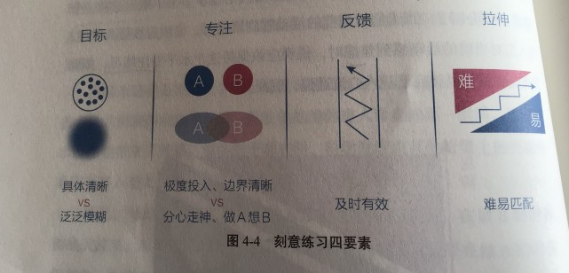

# 第四章 专注力--情绪和智慧的交叉地带

## 第一节 情绪专注：依照提振你的注意力

做A想B的行为模式实实在在地影响着我们，是我们在不知不觉中徒生烦恼、渐生愚钝。是我们烦恼和无能的来源。

### “行动”如躯体，“感受”如灵魂

* 随着行动越来越熟练，我们在行动上集中的注意力越来越少，分散在其他地方的注意力越来越多，于是我们不再去耐心感受行动。
* 分心代替专注，身心开始分离。

### 分心走神的原因与危害

* 原因：一是觉得当下太无聊，追求更有意思的事情；二是觉得当下太痛苦，追求更舒适的事情。
* 一个人专注力的高低可能预示了他今后成就的大小。
* 分心走神的原因与我们大脑的记忆机制有关，人类的大脑使用背景关联记忆的方法，即借助事情的背景或线索等提示信息来让我们想起特定内容，可以极大地降低大脑能耗，弥补大脑神经元处理速度的不足。
* 背景关联记忆的副作用：我们感观到的任何信息，都会引入一些其他记忆内的内容。

### 收回感受，回归当下

* 让感受回归行动。
* 身体感受永远是进入当下状态的最好媒介，感受事物消失的过程是一种很好的专注力训练，比如吃饭时体会味觉从有到无的整个过程。

> 一位行者问老和尚：“您得道前是在做什么？”
>
> 老和尚说：“砍柴、担水、做饭。”
>
> 行者问：“那得道后呢？”
>
> 老和尚说：“砍柴、担水、做饭。”
>
> 行者又问：“那何谓得道？”
>
> 老和尚说：“得道前，砍柴时惦记着挑水，挑水时惦记着做饭；得道后，砍柴即砍柴，担水即担水，做饭即做饭。”

## 第二节 学习专注：深入沉浸式进化双刃剑的安全剑柄

进化是一把双刃剑，它给人类带来能力的同时也带来了痛苦，人们因能感知太多信息而感到心神不宁，或因产生过多欲望而痛苦不堪，有或因担忧能力不足而滋生焦虑，无论顺境或者逆境都不得安生。

### 人类情绪和能力优劣的根本差异

* 人类情绪和能力的优劣差异来自于对自身注意力关注方式的差异。
* 能力弱者极易分心。
* 能力强者的优势在于能够**主动**屏蔽干扰，选择需要的信息并**沉浸**其中。

### 深度沉浸的方法

* 《刻意练习》

* 天才的本质是“正确的方法”加上“大量的练习”。

* 正确的方法具备四个特征：

  * 有定义**明确**的目标。

  * 练习时极度专注。--不断发现技巧上的微妙差异和持续存在的关注点，经历越集中则感知越细微。

  > 变聪明的秘诀：先保持极度关注，想不出答案时再将注意力转换到另一件与此毫不相干的事情上。
  
  * 能获得有效的反馈。
  * 始终在拉伸区练习。米哈里·契克森米哈赖《心流》

审视自己：

* 审视自己的注意力 -- 是被动吸引还是主动选择？
* 审视自己的沉浸度 -- 是分心走神还是极度专注？
* 审视自己的练习量 -- 是浅尝辄止还是大量投入？